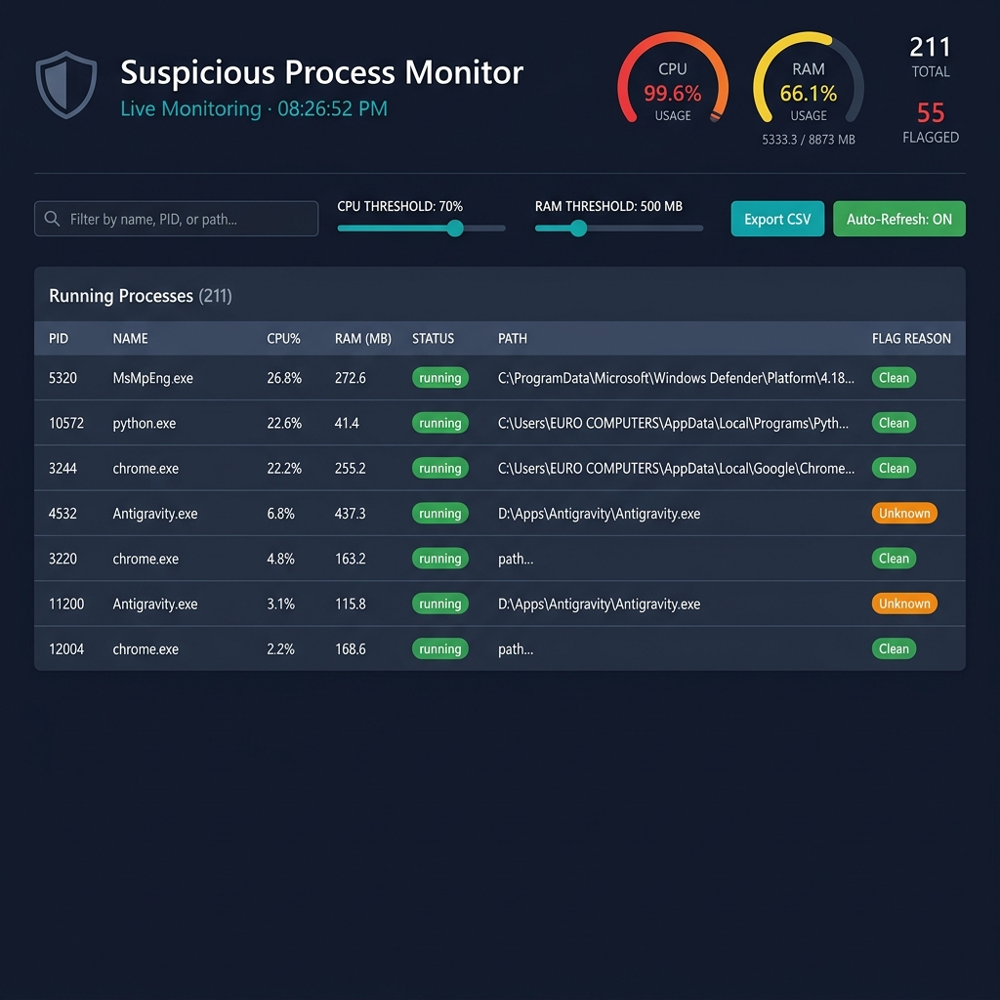

# 🛡️ Suspicious Process Monitor

A **real-time cybersecurity dashboard** built with Python Flask that monitors running system processes, flags suspicious activity based on CPU/memory thresholds and unknown executable detection, and presents findings through an interactive web interface.

## 📸 Dashboard Screenshot



---

## ✨ Features

- **Live Process Monitoring** — View all running processes with PID, name, CPU%, RAM usage, status, and executable path
- **Intelligent Flagging Engine** — Automatically detects:
  - 🔴 **High CPU** — Processes exceeding configurable CPU threshold (default: 70%)
  - 🔴 **High RAM** — Processes exceeding configurable memory threshold (default: 500 MB)
  - 🟠 **Unknown/Suspicious** — Processes not found in the comprehensive whitelist
- **Real-Time Dashboard** — Auto-refreshing every 5 seconds via AJAX polling (no page reloads)
- **System Resource Gauges** — Live CPU and RAM usage gauges with color-coded indicators
- **Searchable & Sortable Table** — Filter processes by name/PID/path and sort any column
- **Configurable Thresholds** — Adjust CPU% and RAM limits via UI sliders (updates backend in real-time)
- **SQLite Event Logging** — All flagged events are automatically persisted to a local database
- **CSV Export** — Download complete flagged process history as a CSV report
- **Comprehensive Whitelist** — 250+ known safe process names across Windows, Linux, and macOS
- **Dark Cybersecurity Theme** — Sleek dark navy UI with cyan accents and glassmorphism design
- **Fully Offline** — Runs 100% on localhost with no external API dependencies

---

## 🖥️ Tech Stack

| Layer        | Technology                         |
|:-------------|:-----------------------------------|
| **Backend**  | Python 3.10+ · Flask 3.0.3        |
| **Monitor**  | psutil 5.9.8                       |
| **Database** | SQLite3 (built-in)                 |
| **Frontend** | HTML5 · Tailwind CSS (CDN) · Vanilla JS |
| **Charts**   | Chart.js (CDN) · Canvas API       |
| **Export**    | Python csv module (built-in)       |

---

## 🚀 Installation & Setup

### Prerequisites
- **Python 3.10+** installed on your system
- A modern web browser (Chrome, Firefox, Edge)

### Steps

```bash
# 1. Clone the repository
git clone https://github.com/Aqibahmed12/suspicious-process-monitor.git
cd suspicious-process-monitor

# 2. Create and activate a virtual environment
python -m venv venv

# Windows
venv\Scripts\activate

# Linux / macOS
source venv/bin/activate

# 3. Install dependencies
pip install -r requirements.txt

# 4. Run the application
python app.py
```

### Open the Dashboard

Navigate to **[http://localhost:5000](http://localhost:5000)** in your browser.

---

## 📁 Project Structure

```
suspicious-process-monitor/
│
├── app.py                  # Main Flask application & API endpoints
├── monitor.py              # psutil process scanning & flagging engine
├── database.py             # SQLite setup, queries, and log management
├── whitelist.py            # Known safe process names (250+ entries)
├── config.py               # Thresholds, paths, and settings
│
├── templates/
│   └── index.html          # Dashboard HTML (Tailwind CSS)
│
├── static/
│   ├── css/
│   │   └── style.css       # Custom CSS overrides
│   └── js/
│       └── dashboard.js    # AJAX polling, rendering, sorting, search
│
├── logs/
│   └── flagged.db          # SQLite database (auto-created)
│
├── exports/                # CSV export files (auto-created)
│
├── requirements.txt        # Python dependencies
└── README.md               # This file
```

---

## 🔌 API Endpoints

| Method | Endpoint          | Description                              |
|:-------|:------------------|:-----------------------------------------|
| GET    | `/`               | Serve the dashboard HTML page            |
| GET    | `/api/processes`  | JSON array of all running processes      |
| GET    | `/api/flagged`    | JSON array of last 20 flagged events     |
| GET    | `/api/system`     | System-wide CPU and RAM statistics       |
| GET    | `/api/export/csv` | Download flagged log as CSV file         |
| POST   | `/api/config`     | Update CPU/RAM thresholds at runtime     |

---

## ⚙️ Configuration

Default thresholds are defined in `config.py` and can be adjusted via the dashboard UI:

| Setting          | Default | Description                    |
|:-----------------|:--------|:-------------------------------|
| CPU_THRESHOLD    | 70%     | Flag processes above this CPU% |
| MEM_THRESHOLD_MB | 500 MB  | Flag processes above this RAM  |
| POLL_INTERVAL_MS | 5000 ms | Dashboard refresh interval     |
| DEBUG_MODE       | True    | Flask debug mode               |

---

## 📝 License

This project is open source and available under the [MIT License](LICENSE).

---

## 👤 Author

**Aqib Ahmed** — [GitHub](https://github.com/Aqibahmed12)
